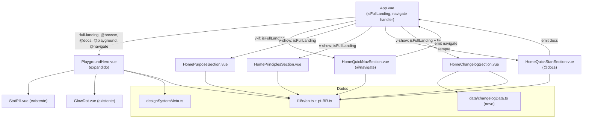

# Design Document — Design System Homepage Revamp

## Overview

Este documento descreve o design técnico para a revitalização da home page do playground do design system. O objetivo é transformar a view atual — um hero simples com pillar cards e bento grid de componentes renderizados — em uma **página editorial de boas-vindas** no estilo Atlassian Design System.

A nova home comunica propósito, estrutura e valor do design system por meio de seções textuais e de navegação, sem renderizar componentes da biblioteca em cards interativos. Os playgrounds de componentes permanecem exclusivamente na seção "Library" (catálogo).

### Decisões Técnicas Centrais

| Decisão | Rationale |
|---|---|
| Novos componentes em `playground/components/` | Seguir a convenção existente do projeto |
| Dados estáticos de changelog em `playground/data/changelogData.ts` | Sem requisição de rede; consistente com `colorPresets.ts` e demais arquivos do diretório |
| Extensão do `PlaygroundHero.vue` em vez de substituição | Preservar API de eventos existente (`browse`, `docs`, `playground`) e adicionar `navigate` |
| Novos namespaces i18n como sub-objetos de `PlaygroundMessages` | Compatibilidade total com o tipo existente; cada seção tem seu próprio namespace |
| `v-show` para seções condicionais (fullLanding) | Evita remontagem desnecessária; comportamento igual ao hero atual |
| Tailwind CSS 4 + design tokens CSS existentes | Consistência visual; sem novos tokens |

---

## Architecture

### Fluxo de Navegação

```
App.vue
 ├─ activePage: 'home' + activeCat: 'all'  → Editorial Home (novo)
 │   ├─ PlaygroundHero (expandido)
 │   ├─ HomeQuickNavSection   (@navigate → setCategory)
 │   ├─ HomePurposeSection    (v-show="isFullLanding")
 │   ├─ HomePrinciplesSection (v-show="isFullLanding")
 │   ├─ HomeQuickStartSection
 │   ├─ Stats_Bar (em PlaygroundHero expandido)
 │   └─ HomeChangelogSection  (v-show="isFullLanding", lg:block)
 │
 ├─ activePage: 'home' + activeCat: <categoria>  → Bento Grid (inalterado)
 ├─ activePage: 'catalog'  → ComponentsCatalogPage (inalterado)
 ├─ activePage: 'docs'     → DocumentationPage (inalterado)
 └─ activePage: 'foundations' → FoundationsPage (inalterado)
```

### Diagrama de Componentes



---

## Components and Interfaces

### PlaygroundHero.vue (modificado)

Mantém a API existente e adiciona o suporte à Stats_Bar completa e ao evento `navigate` indireto (via seções filhas).

```typescript
// Props (sem mudança na interface existente)
defineProps<{
  fullLanding?: boolean
}>()

// Eventos (sem quebrar os existentes)
defineEmits<{
  browse: []
  docs: []
  playground: []
}>()
```

**Mudanças de layout:**
- Remove os pillar cards (substituídos por `HomeQuickNavSection`)
- A Stats_Bar passa a exibir 4 StatPills: componentes, cobertura, demos, versão (string)
- O painel direito do grid é removido quando `fullLanding=true` (a seção Quick Nav assume essa responsabilidade abaixo)

### HomeQuickNavSection.vue (novo)

```typescript
defineEmits<{
  navigate: [category: 'foundations' | 'catalog' | 'docs']
}>()
```

Dados internos estáticos (não prop), usando i18n para textos e `designSystemLibraryComponentCount` para o dado quantitativo de Components.

**Estrutura de dados interna:**

```typescript
interface QuickNavCard {
  id: 'foundations' | 'catalog' | 'docs'
  icon: Component  // Lucide icon component
  titleKey: keyof PlaygroundMessages['homeQuickNav']
  descKey: keyof PlaygroundMessages['homeQuickNav']
  stat: string | number
  category: 'foundations' | 'catalog' | 'docs'
}
```

### HomePurposeSection.vue (novo)

Sem props. Dados de benefícios definidos internamente via i18n.

```typescript
interface PurposeBenefit {
  icon: Component  // Lucide icon
  titleKey: string
  descKey: string
}
```

### HomePrinciplesSection.vue (novo)

Sem props. Renderiza apenas se o array interno tiver exatamente 4 princípios.

```typescript
interface Principle {
  icon: Component  // Lucide icon
  titleKey: string
  descKey: string
}

// Guard: computed que retorna false se principles.length < 4
const shouldRender = computed(() => principles.length >= 4)
```

### HomeQuickStartSection.vue (novo)

```typescript
defineEmits<{
  docs: []
}>()

// Estado interno
const copied = ref(false)
const canCopy = ref(typeof navigator !== 'undefined' && !!navigator.clipboard)

async function copyToClipboard(text: string): Promise<void> {
  if (!canCopy.value) return
  await navigator.clipboard.writeText(text)
  copied.value = true
  setTimeout(() => { copied.value = false }, 1500)
}
```

### HomeChangelogSection.vue (novo)

```typescript
import { changelogEntries } from '../data/changelogData'

// Exibe apenas as primeiras 4 entradas (slice(0, 4))
const entries = computed(() => changelogEntries.slice(0, 4))
```

---

## Data Models

### changelogData.ts

```typescript
// playground/data/changelogData.ts

export type ChangelogType = 'Added' | 'Changed' | 'Fixed'

export interface ChangelogChange {
  type: ChangelogType
  descKey: string  // chave i18n
}

export interface ChangelogEntry {
  version: string
  date: string  // ISO 8601: 'YYYY-MM-DD'
  changes: ChangelogChange[]  // 1–3 itens
}

export const changelogEntries: ChangelogEntry[] = [
  {
    version: '0.17.0',
    date: '2025-01-15',
    changes: [
      { type: 'Added', descKey: 'changelog.v0170.added1' },
      { type: 'Changed', descKey: 'changelog.v0170.changed1' },
    ],
  },
  {
    version: '0.16.0',
    date: '2024-12-10',
    changes: [
      { type: 'Added', descKey: 'changelog.v0160.added1' },
      { type: 'Fixed', descKey: 'changelog.v0160.fixed1' },
    ],
  },
  {
    version: '0.15.0',
    date: '2024-11-05',
    changes: [
      { type: 'Added', descKey: 'changelog.v0150.added1' },
    ],
  },
  {
    version: '0.14.0',
    date: '2024-10-01',
    changes: [
      { type: 'Changed', descKey: 'changelog.v0140.changed1' },
      { type: 'Fixed', descKey: 'changelog.v0140.fixed1' },
    ],
  },
]
```

### Extensão de PlaygroundMessages (types.ts)

```typescript
// Novos namespaces a adicionar na interface PlaygroundMessages

homeHero: {
  exploreComponents: string
  getStarted: string
}

homeQuickNav: {
  sectionTitle: string
  foundationsTitle: string
  foundationsDesc: string
  foundationsStat: string
  componentsTitle: string
  componentsDesc: string
  docsTitle: string
  docsDesc: string
  docsStat: string
  arrowLabel: string
}

homePurpose: {
  sectionTitle: string
  mission: string
  benefit1Title: string
  benefit1Desc: string
  benefit2Title: string
  benefit2Desc: string
  benefit3Title: string
  benefit3Desc: string
}

homePrinciples: {
  sectionTitle: string
  p1Title: string
  p1Desc: string
  p2Title: string
  p2Desc: string
  p3Title: string
  p3Desc: string
  p4Title: string
  p4Desc: string
}

homeQuickStart: {
  sectionTitle: string
  installLabel: string
  importLabel: string
  copyAriaLabel: string
  copiedLabel: string
  docsLink: string
}

homeStats: {
  components: string
  coverage: string
  demos: string
  version: string
}

homeChangelog: {
  sectionTitle: string
  typeAdded: string
  typeChanged: string
  typeFixed: string
  // chaves de descrição dinâmicas (v0170.added1 etc.) também aqui
  [key: string]: string
}
```

### App.vue — Modificações

```typescript
// Nova função de handler para evento navigate
function handleNavigate(category: 'foundations' | 'catalog' | 'docs'): void {
  setCategory(category)
}
```

**Mudança no template:** O bloco `v-else` (TransitionGroup com bento grid) passa a ter condição `v-else-if="!isFullLanding"`. Um novo bloco `v-else-if="isFullLanding"` renderiza a Editorial Home.

```html
<!-- Nova condição no template de App.vue -->
<template v-else-if="isFullLanding">
  <!-- Editorial Home: apenas quando activePage=home e activeCat=all -->
  <HomeQuickNavSection @navigate="handleNavigate" />
  <HomePurposeSection />
  <HomePrinciplesSection />
  <HomeQuickStartSection @docs="openDocs" />
  <HomeChangelogSection />
</template>

<TransitionGroup
  v-else-if="activePage === 'home' && !isFullLanding"
  ...bento grid existente...
/>
```

---

## Correctness Properties

*Uma propriedade é uma característica ou comportamento que deve ser verdadeiro em todas as execuções válidas de um sistema — essencialmente, uma declaração formal sobre o que o sistema deve fazer. Propriedades servem como a ponte entre especificações legíveis por humanos e garantias de correção verificáveis por máquinas.*

### Property 1: Textos i18n são Traduzidos para Qualquer Locale

*Para qualquer* locale válido (`'en'` ou `'pt-BR'`), todos os textos visíveis renderizados pelas seções da home devem ser strings não-vazias e não iguais às chaves i18n brutas (no formato `'namespace.key'`).

**Validates: Requirements 1.6, 2.8, 3.3, 4.5, 5.7, 6.5, 7.4, 9.1**

### Property 2: Reatividade de Locale

*Para qualquer* par de locales distintos (`en` e `pt-BR`), alternar o locale deve resultar em textos visíveis diferentes — o texto em `pt-BR` não deve ser igual ao texto em `en` para chaves que possuem tradução distinta.

**Validates: Requirements 9.2**

### Property 3: Cards de Navegação Sempre Contêm Campos Obrigatórios

*Para qualquer* card da `Quick_Nav_Section`, a renderização deve conter: um ícone, um título não-vazio, uma descrição não-vazia e um dado quantitativo não-vazio.

**Validates: Requirements 2.2**

### Property 4: Benefícios Sempre Contêm Campos Obrigatórios

*Para qualquer* benefício da `Purpose_Section`, a renderização deve conter: um ícone, um título não-vazio (≤ 40 caracteres) e uma descrição não-vazia (≤ 120 caracteres).

**Validates: Requirements 3.2**

### Property 5: Seções Condicionais Ocultas quando fullLanding=false

*Para qualquer* estado onde `fullLanding` é `false`, as seções `Purpose_Section`, `Principles_Section` e `Changelog_Section` não devem ser visíveis no DOM renderizado.

**Validates: Requirements 3.6, 4.6, 7.5**

### Property 6: Principles_Section Omitida com Menos de 4 Princípios

*Para qualquer* array de princípios com `length < 4`, o componente `HomePrinciplesSection` não deve renderizar nenhum conteúdo visível.

**Validates: Requirements 4.3**

### Property 7: Tipos de Changelog Restritos ao Conjunto Válido

*Para qualquer* entrada no array `changelogEntries`, cada mudança deve ter `type` pertencente ao conjunto `{ 'Added', 'Changed', 'Fixed' }` — nunca outro valor.

**Validates: Requirements 7.2**

### Property 8: Contagem de Entradas de Changelog Dentro do Intervalo

*Para qualquer* `changelogData` fornecido, o número de entradas renderizadas pela `Changelog_Section` deve estar no intervalo `[2, 4]` — nunca menos de 2 nem mais de 4.

**Validates: Requirements 7.1**

### Property 9: Home All Não Renderiza Bento Grid

*Para qualquer* estado onde `activePage === 'home'` e `activeCat === 'all'`, o bento grid (`ds-bento-grid`) não deve estar presente no DOM renderizado.

**Validates: Requirements 8.1, 8.3**

### Property 10: Home com Categoria Específica Renderiza Bento Grid

*Para qualquer* categoria em `{ 'forms', 'labels', 'feedback', 'layout', 'foundations' }` com `activePage === 'home'`, o bento grid deve estar presente no DOM renderizado.

**Validates: Requirements 8.2**

---

## Error Handling

### navigator.clipboard Indisponível

O `HomeQuickStartSection` verifica `typeof navigator !== 'undefined' && !!navigator.clipboard` na montagem e armazena o resultado em `canCopy`. O botão de copiar é renderizado condicionalmente com `v-if="canCopy"`. Nenhum erro é lançado em ambientes sem suporte.

### Chave i18n Ausente

O composable `usePlaygroundLocale` já implementa fallback retornando a chave bruta quando a tradução não é encontrada (conforme requisito 9.4). Nenhuma mudança necessária.

### changelogData.ts com Dados Inválidos

O componente `HomeChangelogSection` usa `.slice(0, 4)` para limitar entradas e filtra itens cujo array `changes` esteja vazio. Tipos inválidos de changelog são ignorados na renderização de badges.

### Principles com Array Incompleto

O `computed` `shouldRender` em `HomePrinciplesSection` retorna `false` se `principles.length < 4`, e o template usa `v-if="shouldRender"` para omitir a seção inteiramente.

---

## Testing Strategy

### PBT é Aplicável a Esta Feature?

Sim. A feature envolve:
- Lógica condicional de renderização baseada em props (fullLanding, categoria)
- Transformação de dados de changelog (filtragem, contagem, type-checking)
- Tradução i18n reativa (função pura: locale → texto)
- Guards de validação (Principles com < 4 entradas)

Essas são funções com entradas variáveis onde 100 iterações revelariam mais bugs que 2–3 exemplos.

### Abordagem Dual

**Testes Unitários (exemplo-based):**
- Presença de elementos específicos (CTAs, logo, badge de versão)
- Navegação: evento correto emitido para cada card/botão
- Comportamento de copy: mock de `navigator.clipboard`, verificação de `writeText`
- Feedback visual de cópia: fake timers verificando duração de 1500ms
- Fallback de clipboard: ambiente sem API, botão ausente sem erro

**Testes de Propriedade (property-based):**
- Biblioteca: **Vitest** + **fast-check** (já no ecossistema do projeto)
- Mínimo 100 iterações por propriedade

### Configuração de Testes de Propriedade

```typescript
// Exemplo de estrutura para os property tests
import { test } from 'vitest'
import * as fc from 'fast-check'

// Feature: design-system-homepage-revamp, Property 1: i18n texts are translated
test('P1: textos i18n são traduzidos para qualquer locale', () => {
  fc.assert(
    fc.property(
      fc.constantFrom('en', 'pt-BR' as const),
      (locale) => {
        // montar componente com locale, verificar textos
      }
    ),
    { numRuns: 100 }
  )
})
```

Cada teste de propriedade deve incluir comentário de tag no formato:
`// Feature: design-system-homepage-revamp, Property {N}: {texto}`

### Testes de Integração

- Navegação completa: `App.vue` com simulação de cliques nos cards → `activePage` e `activeCat` corretos
- Troca de locale em `App.vue`: verificar que `t()` retorna strings em pt-BR após troca

### Testes Smoke (verificação manual/CI)

- Responsividade em viewport 320px: sem overflow horizontal
- Acessibilidade: `aria-label` em todos os interativos, navegação por teclado (Tab/Enter/Space)
- Compilação TypeScript: `tsc --noEmit` passa com os novos namespaces em `types.ts`
