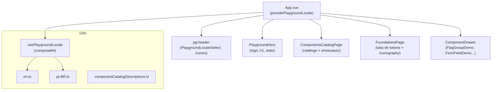

# Design Document — Design System UI Improvements

## Overview

Este documento cobre o design técnico das melhorias e correções de UI no playground do design system Vue 3 + TypeScript. As mudanças são majoritariamente cirúrgicas — alterações de template, reatividade e limpeza de texto — dentro de arquivos já existentes em `packages/design-system/playground/`.

As dez melhorias são agrupadas conforme seus requisitos correspondentes:

1. **FlagGroupDemo** — toggle interativo para `isDismissible`
2. **FoundationsPage** — nova tab "Iconography"
3. **ComponentsCatalogPage** — showcase "AI Chat" no catálogo
4. **FormFieldDemo** — correção do ícone à esquerda do `Input`
5. **i18n** — remoção de referências residuais a "Appearance"
6. **usePlaygroundLocale** — correção da reatividade do seletor de idioma
7. **App.vue** — ícone GitHub
8. **App.vue** — remoção do badge "stable"
9. **App.vue / PlaygroundHero** — remoção dos elementos de versão
10. **PlaygroundHero** — remoção dos botões CTA


## Architecture

O playground é uma SPA Vue 3 sem roteador dedicado — a navegação é controlada por `activePage` e `activeCat` em `App.vue`. Não há estado global (Pinia/Vuex); o único estado compartilhado é o locale, injetado via `provide/inject` a partir de `providePlaygroundLocale()` no `App.vue`.



Todas as alterações são **isoladas** — nenhuma requer nova infraestrutura, nova dependência ou mudança de build.


## Components and Interfaces

### Req 1 — FlagGroupDemo (`playground/demos/FlagGroupDemo.vue`)

**Mudanças no `<script setup>`:**
- Adicionar `import { computed, ref } from 'vue'`
- Adicionar `import { Switch } from '@/index'`
- Adicionar `const isDismissible = ref(false)`
- Converter `code` de `const` para `computed` que inclui condicionalmente `:is-dismissible="true"` baseado em `isDismissible.value`

**Mudanças no `<template>`:**
- Adicionar `<label>` com `<Switch v-model="isDismissible" />` acima do bloco `pg-playground-panel`
- Passar `:is-dismissible="isDismissible"` para cada `<Flag>` dentro de `<FlagGroup>`

**Interface do snippet `code` (computed):**
```typescript
const code = computed(() => {
  const dismissLine = isDismissible.value ? '\n    :is-dismissible="true"' : ''
  return `<FlagGroup>\n  <Flag\n    :variant="'success'"${dismissLine}\n    ...\n  />\n  ...\n</FlagGroup>`
})
```

### Req 2 — FoundationsPage (`playground/views/FoundationsPage.vue`)

**Mudanças no `<script setup>`:**
- Adicionar `'iconography'` ao union type `TabId`
- Adicionar `{ id: 'iconography', label: 'Iconography' }` ao final do array `tabs`
- Importar `iconography` de `@/icons/iconography`
- Importar `useCopy` de `'../composables/useCopy'`
- Adicionar `const searchQuery = ref('')`
- Adicionar `const iconSize = ref(24)`
- Adicionar `const iconColor = ref('')`
- Adicionar `const iconSizes = [12, 16, 20, 24]`
- Adicionar `const filteredIcons = computed(...)` com filtro por label/name
- Adicionar `const { copy, copied, copiedKey } = useCopy('')` para feedback visual
- Adicionar `async function copyIcon(label: string): Promise<void>` que chama `navigator.clipboard.writeText('<LabelSemEspaços />')` com feedback de 1500ms

**Mudanças no `<template>`:**
- Adicionar `<section v-else-if="activeTab === 'iconography'">` após a seção `borders`
- A seção contém: campo de busca (`<input v-model="searchQuery">`), controles de tamanho (botões), controle de cor (`<input type="color" v-model="iconColor">`), grid de ícones com botões clicáveis e feedback visual "Copied!"

**Fonte dos ícones:** `@/icons/iconography` — mesmo source usado por `IconsCard.vue`. Cada item tem `{ name, label, component }`.

**Feedback de cópia:** usar `setTimeout` de 1500ms para resetar o estado de `copiedKey` (nome do ícone mais recentemente copiado) — mostrar "✓" ou texto "Copied" ao lado do ícone por 1500ms.


### Req 3 — ComponentsCatalogPage (`playground/views/ComponentsCatalogPage.vue`)

**Mudanças no `<script setup>`:**
- Importar `showcaseDemoComponents` de `'../designSystemMeta'`
- Importar `ChatPreviewCard` de `'../cards/ChatPreviewCard.vue'`
- Ampliar o tipo de `selectedName` para `string` (já é `ref<string>`)
- Adicionar `const isShowcase = computed(() => (showcaseDemoComponents as readonly string[]).includes(selectedName.value))`
- A função `selectComponent` já funciona para qualquer string — funciona para showcases sem alteração
- Adicionar função `descriptionForShowcase(name: string)` que busca em `messages.value.drawer.descriptions[name]`

**Mudanças no `<template>` — nav lateral:**
- Após o loop `v-for="group in localizedGroups"`, adicionar uma seção separada de "Showcases":
  ```html
  <section class="pg-catalog-nav-group">
    <h4 class="pg-catalog-nav-group-label">Showcases</h4>
    <ul class="pg-catalog-nav-group-items">
      <li v-for="name in showcaseDemoComponents" :key="name">
        <button class="pg-catalog-nav-item" :class="{ 'pg-catalog-nav-item--active': selectedName === name }" @click="selectComponent(name)">
          {{ name }}
        </button>
      </li>
    </ul>
  </section>
  ```

**Mudanças no `<template>` — painel de detalhes:**
- No cabeçalho do detalhe, ao lado de `<h3>{{ selectedName }}</h3>`, adicionar condicionalmente:
  ```html
  <span v-if="isShowcase" class="...">Showcase</span>
  ```
- Substituir o bloco `<div class="space-y-5 ...">` (API + Usage) por lógica condicional:
  - Se `isShowcase`: renderizar `<ChatPreviewCard />` diretamente (sem API Reference nem UsageBlock)
  - Se não showcase: manter o conteúdo atual (`ComponentApiReference` + `UsageBlock`)

**Decisão de design:** A seleção pelo `<select>` mobile também deve incluir os showcases como `<optgroup label="Showcases">`.

### Req 4 — FormFieldDemo (`playground/demos/FormFieldDemo.vue`)

**Análise do problema:** O código atual já tem a estrutura correta — o container `<div class="relative">` existe, o `<Mail>` tem `absolute`, e `inputPaddingClass` retorna `'pl-9'` quando `withIcon=true`. O `:class="inputPaddingClass"` já está sendo aplicado no `<Input>`.

**Causa provável do bug visual:** O `<Input>` internamente aplica classes que sobrescrevem ou o componente `FormField` tem `overflow: hidden`. A solução é garantir que o `z-index` do ícone seja suficiente (já tem `pointer-events-none`) e que o `Input` não tenha `overflow: hidden` que corte o ícone absolutamente posicionado. O ícone está **fora** do `Input` no container pai `relative` — o problema pode ser que o `Input` component renderize com `position: relative` e `z-index` que sobreponha o ícone.

**Solução:** Verificar e adicionar `style="z-index: 1"` ou `class="z-10"` no ícone `<Mail>` se necessário. O container `relative` já existe. Se o `Input` tiver `overflow: hidden`, a solução é adicionar `overflow: visible` ao `Input` via prop de classe, mas como o ícone está no container pai (não dentro do `Input`), o overflow do `Input` não deve afetar o ícone. A solução mais simples é adicionar `class="z-10"` ao `<Mail>` para garantir sobreposição.


### Req 5 — i18n: remoção de "Appearance" (`en.ts`, `pt-BR.ts`, `componentCatalogDescriptions.ts`)

**Análise das ocorrências:**
- `en.ts` → `drawer.descriptions.Button`: `"Use :variant to communicate hierarchy."` — já correto (sem "appearance").
- `componentCatalogDescriptionsEn.Button`: `"Use :variant to communicate hierarchy and emphasis."` — já correto.
- Verificar `Flag` e `SectionMessage` em ambos os arquivos — as descrições atuais já usam "variant" corretamente.
- `labelsPlayground.boldAppearance` em `en.ts` e `labelsPlayground.boldAppearance` em `pt-BR.ts` descrevem o modo visual do Lozenge — **preservar** conforme spec.

**Arquivos a inspecionar e corrigir se necessário:**
- `playground/i18n/en.ts`: buscar strings com "appearance" referentes a Button, Flag, SectionMessage
- `playground/i18n/pt-BR.ts`: idem
- `playground/i18n/componentCatalogDescriptions.ts`: idem

**Regras de substituição:**
- "appearance" como nome de prop → substituir por "variant"
- `LozengeAppearance`, `TooltipAppearance`, `PopoverAppearance` → **não alterar** (são TypeScript types)
- `boldAppearance` → **não alterar** (descreve modo visual)
- Textos como "Bold appearance" → **não alterar** (modo visual, não nome de prop)

### Req 6 — usePlaygroundLocale / PlaygroundLocaleSelect

**Diagnóstico do código atual:**
Ao ler `usePlaygroundLocale.ts`, a implementação já está correta:
- `locale` é `ref<PlaygroundLocale>`
- `setLocale` muta `locale.value = next`
- `messages` é `computed(() => localeCatalog[locale.value])`
- `provide(PlaygroundLocaleKey, ctx)` expõe o objeto com `locale` (Ref reativo)

`PlaygroundLocaleSelect.vue` usa `localeValue` como computed writable que chama `setLocale` no setter. Isso está correto.

**Causa provável do bug:** O `Select` component pode não estar emitindo `update:modelValue` corretamente, ou o `v-model` no `Select` não está conectado ao setter do computed. Verificar se o componente `Select` de `@/index` aceita `v-model` com o tipo correto (string vs. objeto de opção).

**Solução:** Verificar que `Select` emite `update:modelValue` com o `value` string (não o objeto `{ value, label }`). Se necessário, adicionar um handler explícito:
```vue
<Select
  :model-value="locale"
  :options="[...LOCALE_OPTIONS]"
  @update:model-value="(v) => setLocale(v as PlaygroundLocale)"
/>
```

Se `Select` emite o objeto completo, usar `.value` na extração. A solução é tornar o binding explícito e tipado.

### Req 7 — App.vue: ícone GitHub

**Mudança cirúrgica em `App.vue`:**
```diff
- import { ArrowUpRight, Moon, Sun } from 'lucide-vue-next'
+ import { Github, Moon, Sun } from 'lucide-vue-next'
```
```diff
- <ArrowUpRight :size="14" />
+ <Github :size="16" />
```

### Req 8 — App.vue: remoção do badge "stable"

**Mudança cirúrgica em `App.vue`:** Remover o `<span>` com `t('app.stable')`:
```diff
- <span
-   class="hidden rounded-md px-2 py-1 font-mono text-[10px] xl:inline"
-   :style="{ background: 'var(--pg-stable-bg)', color: 'var(--pg-stable-text)' }"
- >
-   {{ t('app.stable') }}
- </span>
```

### Req 9 — App.vue e PlaygroundHero: remoção de versão

**App.vue:** Remover o segundo `<span>` de `pg-header-brand`:
```diff
- <span class="pg-text-muted font-mono text-[10px]">{{ t('app.versionBadge', { version: designSystemVersionBadge }) }}</span>
```

**PlaygroundHero.vue:** Remover o `<div class="mb-6 flex items-center gap-2">` completo (contém apenas GlowDot + span de versão). Como o div não tem outro conteúdo, remover o bloco inteiro é a solução mais limpa.

### Req 10 — PlaygroundHero: remoção dos botões CTA

**PlaygroundHero.vue:** Remover o bloco `<div class="mt-6 flex flex-wrap items-center gap-3">` com os três `<Button>`. Preservar o `<p>` de subtítulo acima e os `StatPill` abaixo.

**App.vue:** Os eventos `@browse`, `@docs`, `@playground` podem ser removidos do binding `<PlaygroundHero>`. As funções `openCatalog`, `openDocs`, `scrollToPlayground` são mantidas — outros elementos podem precisar delas. Os `defineEmits` em `PlaygroundHero` podem ser removidos para limpar a interface.


## Data Models

### Req 2 — Extensão de `TabId` em FoundationsPage

```typescript
type TabId =
  | 'colors'
  | 'gradients'
  | 'typography'
  | 'spacing'
  | 'radius'
  | 'shadows'
  | 'motion'
  | 'zindex'
  | 'borders'
  | 'iconography'  // ← adicionado
```

### Req 3 — Tipo de seleção em ComponentsCatalogPage

Nenhum novo tipo necessário. `selectedName` já é `ref<string>`. A distinção showcase/componente é feita via:

```typescript
import { showcaseDemoComponents } from '../designSystemMeta'
// showcaseDemoComponents: readonly ['AI Chat']

const isShowcase = computed(() =>
  (showcaseDemoComponents as readonly string[]).includes(selectedName.value)
)
```

### Req 6 — Interface do contexto de locale (sem alteração)

```typescript
export interface PlaygroundLocaleContext {
  locale: Ref<PlaygroundLocale>
  messages: ComputedRef<PlaygroundMessages>
  setLocale: (next: PlaygroundLocale) => void
  toggleLocale: () => void
  t: (path: string, params?: Record<string, string | number>) => string
}
```

A interface não muda. O `locale` já é um `Ref` reativo exposto via `provide`.

### Req 1 — Estado de FlagGroupDemo

```typescript
const isDismissible = ref(false)

const code = computed((): string => {
  const dismissAttr = isDismissible.value ? '\n    :is-dismissible="true"' : ''
  return `<FlagGroup>\n  <Flag\n    :variant="'success'"${dismissAttr}\n    :title="'Changes saved'"\n    :description="'Your changes were saved successfully.'"\n  />\n  <Flag\n    :variant="'warning'"${dismissAttr}\n    :title="'Deploy queued'"\n    :description="'Deployment is pending.'" \n  />\n</FlagGroup>`
})
```


## Correctness Properties

*A property is a characteristic or behavior that should hold true across all valid executions of a system — essentially, a formal statement about what the system should do. Properties serve as the bridge between human-readable specifications and machine-verifiable correctness guarantees.*

Da análise de prework, as seguintes propriedades são candidatas à property-based testing (PBT). Após reflection, consolidamos as propriedades sobrepostas.

**Property Reflection:**
- 6.1 (atualizar textos ao trocar locale) e 6.3 (persistir locale) são propriedades distintas e complementares — ambas mantidas.
- 6.4 (inicializar do localStorage) é um round-trip de 6.3 — pode ser combinado: "para qualquer locale, setLocale + novo contexto deve retornar o mesmo locale". Mantemos como propriedade separada por clareza.
- 2.3 (todos os ícones renderizados) e 2.5 (copiar ao clicar) são propriedades independentes — ambas mantidas.
- 1.5 (snippet reflete isDismissible) e 3.4 (showcase renderiza componente correto) são propriedades universalmente quantificadas — ambas mantidas.
- 5.1 (ausência de "appearance" em descrições) — propriedade de invariante de conteúdo — mantida.

---

### Property 1: Snippet do FlagGroupDemo reflete estado de isDismissible

*Para qualquer* valor booleano de `isDismissible`, o snippet de código gerado pelo `computed code` deve conter a string `':is-dismissible="true"'` se e somente se `isDismissible` for `true`.

**Validates: Requirements 1.5**

---

### Property 2: Todos os ícones são renderizados na tab Iconography

*Para qualquer* item no array `iconography[]`, quando a tab "Iconography" está ativa na `FoundationsPage`, deve existir um elemento no DOM correspondente a esse ícone (identificável pelo `name` ou `label` do item).

**Validates: Requirements 2.3**

---

### Property 3: Clicar em um ícone copia o snippet correto

*Para qualquer* item no array `iconography[]`, ao clicar no botão correspondente na tab "Iconography", a função `navigator.clipboard.writeText` deve ser chamada com o valor `'<' + item.label.replace(/\s+/g, '') + ' />'`.

**Validates: Requirements 2.5**

---

### Property 4: t() retorna o valor correspondente ao locale ativo

*Para qualquer* path de tradução válido, após chamar `setLocale('pt-BR')`, a função `t(path)` deve retornar o valor de `ptBR[path]`; após `setLocale('en')`, deve retornar o valor de `en[path]`.

**Validates: Requirements 6.1, 6.2**

---

### Property 5: setLocale persiste o locale no localStorage

*Para qualquer* locale válido (`'en'` | `'pt-BR'`), chamar `setLocale(locale)` deve resultar em `localStorage.getItem('ds-playground-locale') === locale`.

**Validates: Requirements 6.3**

---

### Property 6: Novo contexto de locale inicializa com o valor salvo

*Para qualquer* locale válido salvo em `localStorage` com a chave `'ds-playground-locale'`, um novo contexto criado por `providePlaygroundLocale()` deve ter `locale.value` igual ao valor salvo.

**Validates: Requirements 6.4**

---

### Property 7: Descrições de Button, Flag e SectionMessage não contêm "appearance" como prop canônica

*Para cada* entrada de Button, Flag e SectionMessage nos arquivos de descrição (`en.ts`, `pt-BR.ts`, `componentCatalogDescriptions.ts`), o valor string não deve conter a palavra "appearance" como nome de prop (i.e., em contextos como "use :appearance", "the appearance prop", etc.), mas pode conter "appearance" em outros contextos semânticos.

**Validates: Requirements 5.1, 5.2, 5.3, 5.4**

---

### Property 8: Seleção de showcase renderiza o componente de preview correto

*Para qualquer* nome em `showcaseDemoComponents`, ao selecionar esse item no `ComponentsCatalogPage`, o painel de detalhes deve renderizar o componente de preview correspondente (para "AI Chat": `ChatPreviewCard`) e não deve renderizar `ComponentApiReference` nem `UsageBlock`.

**Validates: Requirements 3.4**


## Error Handling

### Req 6 — usePlaygroundLocale sem provider

Já coberto pelo código existente:
```typescript
export function usePlaygroundLocale(): PlaygroundLocaleContext {
  const ctx = inject(PlaygroundLocaleKey)
  if (!ctx) {
    throw new Error('usePlaygroundLocale() must be used within a component that calls providePlaygroundLocale()')
  }
  return ctx
}
```
Nenhuma alteração necessária na lógica de erro.

### Req 2 — Falha de cópia na clipboard API

A cópia via `navigator.clipboard.writeText()` pode falhar em contextos não-HTTPS ou sem permissão. Envolver em `try/catch` e exibir feedback de erro, ou silenciar graciosamente sem travar a UI:

```typescript
async function copyIcon(label: string): Promise<void> {
  const snippet = `<${label.replace(/\s+/g, '')} />`
  try {
    await navigator.clipboard.writeText(snippet)
    copiedKey.value = label
    setTimeout(() => { copiedKey.value = null }, 1500)
  } catch {
    // silencia — o usuário vê o nome do ícone e pode copiar manualmente
  }
}
```

### Req 5 — Strings de i18n não encontradas

O `resolvePath` existente retorna `path` (a chave) quando o valor não é string, evitando erros em runtime. Não há tratamento adicional necessário.

### Req 3 — Showcase sem componente de preview mapeado

Para robustez, o painel de detalhes de showcase deve ter um fallback caso um novo showcase seja adicionado a `showcaseDemoComponents` sem componente de preview mapeado:
```html
<component :is="showcasePreviewComponent" v-if="showcasePreviewComponent" />
<p v-else class="pg-text-subtle text-sm">Preview not available</p>
```
Onde `showcasePreviewComponent` é um computed que mapeia nome → componente.


## Testing Strategy

As mudanças deste spec são majoritariamente de UI/template e de lógica de apresentação, com uma camada de lógica pura no composable de locale e no computed de snippet. A estratégia combina:

- **Property-based tests**: para propriedades universalmente quantificadas (locale, snippet, clipboard, descrições)
- **Unit/component tests**: para comportamentos específicos de UI (presença de elementos, classes CSS, bindings)
- **Smoke checks**: para verificações estáticas de template (ausência de elementos removidos)

### Biblioteca de PBT recomendada

**[fast-check](https://fast-check.dev/)** — biblioteca PBT para JavaScript/TypeScript. Integra-se nativamente com Vitest (test runner já em uso no projeto).

```bash
# já deve estar disponível como devDependency; se não:
pnpm add -D fast-check
```

Configuração por teste: mínimo de **100 iterações** (padrão do fast-check é 100).

### Testes por requisito

#### Req 1 — FlagGroupDemo

- **Property 1** — `fast-check`: `fc.boolean()` → verificar que `code.value.includes(':is-dismissible="true"') === isDismissible`
  - Tag: `Feature: design-system-ui-improvements, Property 1: snippet reflete isDismissible`
- **Unit**: montar componente, verificar que Switch existe no DOM; ativar toggle, verificar que cada Flag recebe `isDismissible=true`

#### Req 2 — FoundationsPage Iconography tab

- **Property 2** — `fast-check`: `fc.constantFrom(...iconography)` → para cada item, verificar presença no DOM quando tab ativa
  - Tag: `Feature: design-system-ui-improvements, Property 2: todos os ícones renderizados`
- **Property 3** — `fast-check`: `fc.constantFrom(...iconography)` → mock `navigator.clipboard.writeText`, clicar botão, verificar argumento
  - Tag: `Feature: design-system-ui-improvements, Property 3: clicar copia snippet correto`
- **Unit**: verificar tab "Iconography" no tablist; verificar que é a última tab; verificar input de busca e controles de tamanho

#### Req 3 — ComponentsCatalogPage showcases

- **Property 8** — `fast-check`: `fc.constantFrom(...showcaseDemoComponents)` → selecionar cada showcase, verificar que ChatPreviewCard é renderizado e API Reference não
  - Tag: `Feature: design-system-ui-improvements, Property 8: showcase renderiza preview correto`
- **Unit**: verificar seção "Showcases" na nav; verificar badge "Showcase" no painel; verificar que "AI Chat" aparece na lista

#### Req 4 — FormFieldDemo icon fix

- **Unit**: montar com `withIcon=true`, verificar que Mail está no DOM com `z-10`, container tem `relative`, Input tem classe `pl-9`
- **Unit**: montar com `withIcon=false`, verificar ausência de Mail e ausência de `pl-9`

#### Req 5 — i18n appearance

- **Property 7** — `fast-check`: `fc.constantFrom('Button', 'Flag', 'SectionMessage')` → para cada componente, verificar que descrição em en e pt-BR não contém "appearance" seguido de padrão de nome de prop
  - Tag: `Feature: design-system-ui-improvements, Property 7: descrições sem appearance como prop`
- **Unit**: verificar que `LozengeAppearance`, `TooltipAppearance`, `PopoverAppearance` permanecem nos tipos

#### Req 6 — locale reactivity

- **Property 4** — `fast-check`: `fc.constantFrom('en', 'pt-BR')` × `fc.constantFrom(...translationPaths)` → verificar que `t(path)` retorna valor correto após `setLocale`
  - Tag: `Feature: design-system-ui-improvements, Property 4: t() retorna valor do locale ativo`
- **Property 5** — `fast-check`: `fc.constantFrom('en', 'pt-BR')` → verificar localStorage após `setLocale`
  - Tag: `Feature: design-system-ui-improvements, Property 5: setLocale persiste no localStorage`
- **Property 6** — `fast-check`: `fc.constantFrom('en', 'pt-BR')` → setar localStorage, criar novo contexto, verificar `locale.value`
  - Tag: `Feature: design-system-ui-improvements, Property 6: contexto inicializa com locale salvo`
- **Edge case**: chamar `usePlaygroundLocale()` fora de `providePlaygroundLocale()` → verificar erro descritivo

#### Reqs 7–10 — mudanças de template

- **Unit/Smoke**: Renderizar `App.vue` e verificar:
  - Req 7: ícone Github no link GitHub (não ArrowUpRight)
  - Req 8: ausência de `t('app.stable')` no DOM
  - Req 9: ausência do span de `versionBadge` em `pg-header-brand`
- **Unit/Smoke**: Renderizar `PlaygroundHero` e verificar:
  - Req 9: ausência do span de `versionLine` (ou ausência do div completo)
  - Req 10: ausência do bloco `div.mt-6` com os botões CTA; presença de `h1`, `p` de subtítulo e `StatPill`s

### Cobertura complementar

- Testes de unit existentes para `Flag`, `FlagGroup` (lógica de remoção de flags) não precisam ser alterados — a prop `isDismissible` já deve ser coberta no nível do componente.
- O comportamento do `Select` de locale pode ser verificado com um teste de componente montado com `providePlaygroundLocale()` no contexto.

